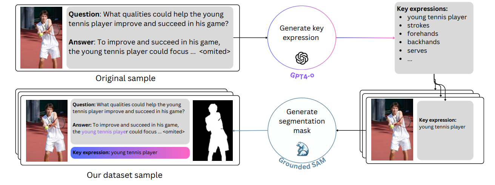

# FiVL: A Framework for Improved Vision-Language Alignment

**Authors**: Estelle Aflalo, Gabriela Ben Melech Stan, Tiep Le, Man Luo , Shachar Rosenman , Sayak Paul, Shao-Yen Tseng , Vasudev Lal 

[ [Project Page](https://intellabs.github.io/multimodal_cognitive_ai/FiVL)]  [[FiVL-Instruct Dataset](https://huggingface.co/Intel/fivl-instruct)] [[Model](https://huggingface.co/Intel/fivl-vm)] [[Paper](https://arxiv.org/abs/2412.14672)]

In this work, we introduce FiVL, a novel method for constructing datasets designed to train LVLMs for enhanced visual grounding and to evaluate their effectiveness in achieving it. These datasets can be utilized for both training and assessing an LVLM's ability to use image content as substantive evidence rather than relying solely on linguistic priors, providing insights into the model's reliance on visual information. 
To demonstrate the utility of our dataset, we introduce an innovative training task that outperforms baselines alongside a validation method and application for explainability.

  


 This repository contains all the resources necessary to reproduce our work, including scripts for data augmentation, evaluation, training, and explainability as well as our FiVL-Instruct dataset and our checkpoint.

## Key Resources  
<!--
- **Dataset**: [Hugging Face Dataset](<https://huggingface.co/Intel/fivl-instruct>)  
- **Model**: [Hugging Face Model](<https://huggingface.co/Intel/fivl-vm>)  
-->
- **Dataset**: [Hugging Face Dataset] ** Dataset coming soon. **
- **Model**: [Hugging Face Model] ** Model coming soon. **

---

## How to Use  
1. Clone this repository:  
   ```bash
   git clone https://https://github.com/IntelLabs/multimodal_cognitive_ai.git
2. Install dependencies 
    ```bash
    cd FiVL
    pip install -r requirements.txt
3. Download our FiVL-Instruct dataset and place it under training/LLaVA/playground. 
4. Download original images from [LLaVA-Instruct-mix665k dataset](https://huggingface.co/datasets/liuhaotian/LLaVA-Instruct-150K/blob/main/llava_v1_5_mix665k.json) to training/LLaVA/playground/data as well as the [pretrained mm projector](https://github.com/haotian-liu/LLaVA/blob/main/docs/MODEL_ZOO.md)
4. Follow the steps in the relevant sections:  [Pipeline](#pipeline), [Evaluation](#evaluation), [Training](#training), and [XAI](#xai).

---

## Repository Overview  

### Pipeline  
Scripts in this section are related to the FiVL pipeline for data augmentation and the method's evaluation. 
- `augment_dataset/extract_key_expressions.py` - Extracts the key expressions with GPT4o  
- `augment_dataset/generate_segmentation_maps.py` - Generates the segmentations maps based on the key expressions. 
- `method_eval/manual_eval.py` - APi for manual annotations  
- `method/eval/automatic_eval.py` - GPT4o queries for automatic annotations

### Evaluation  
This section describes how we computed Visual Reliance Scores, as detailed in our paper.  
- `compute_reliance_score.py` - Implements the visual reliance scoring methodology.  
- `evaluate_model.py` - Evaluates the trained model using reliance metrics.  

### Training  
Our method for training is shared in this section. The scripts here are based on a fork of the repository [LLaVA, sha:c121f04](<https://github.com/haotian-liu/LLaVA/>) and augmented with our vision modeling task.  
- `training/LLaVA/scripts/v1_5/finetune_fivl.sh` - Main script for training the model. 
- `training/visualize_vision_logits.py` - Visualize the segmentation maps produced by our model

### XAI (Explainability)  
This section includes scripts for generating head summary grid as well as visualizing explainability maps on images. 
- `generate_head_summary.py` - Produces explainability heads summary grid. 
- `probe_head.py` - Visualizes the attention head overlaid on the image. 


---

## Citation 
If you use this work in your research, please cite our paper:
